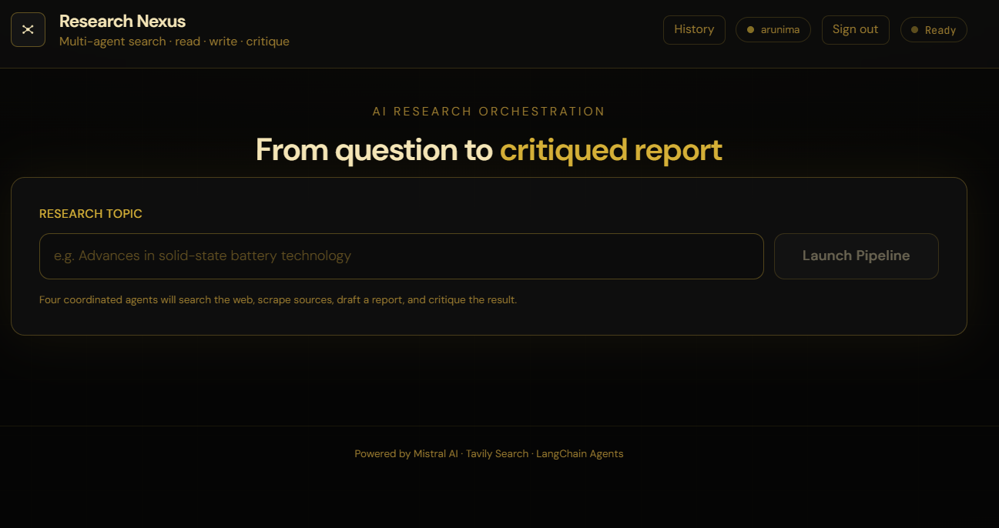
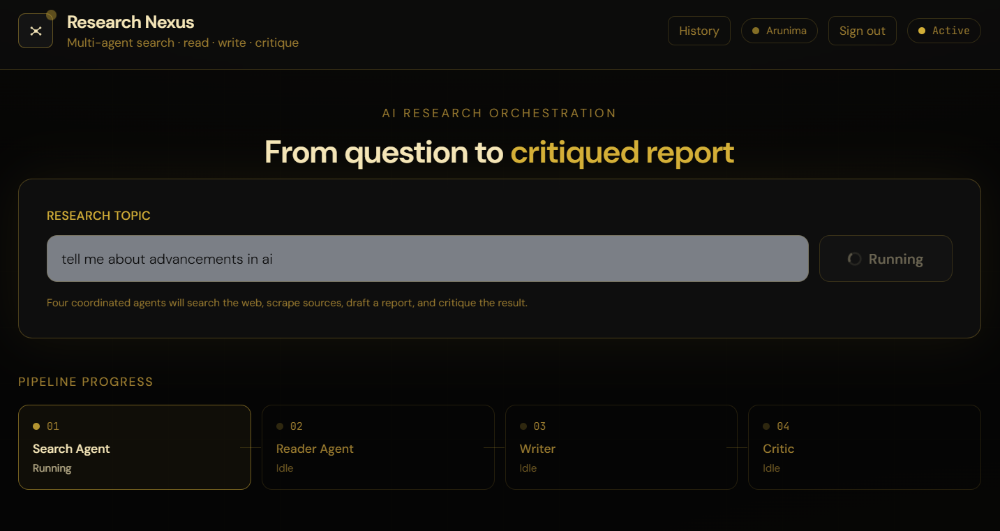
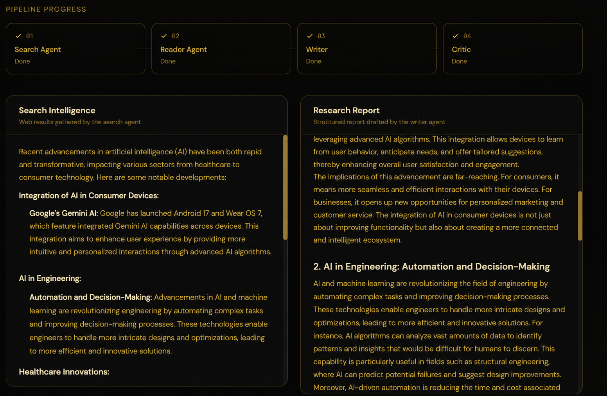
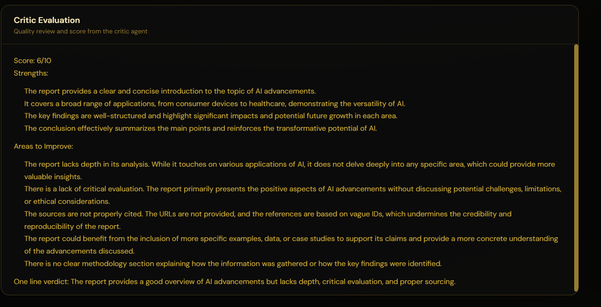
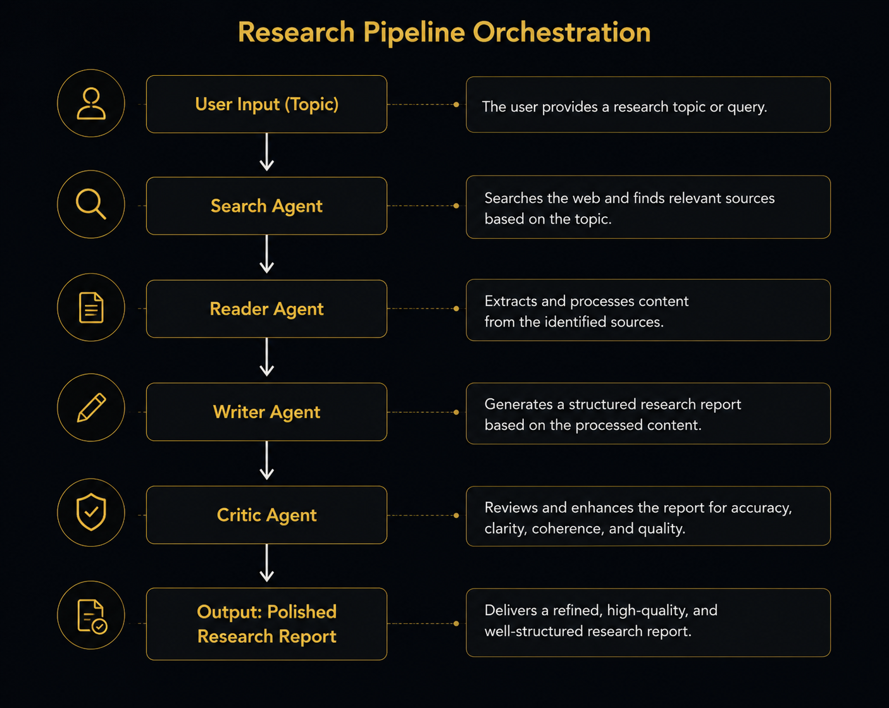

# 🔬 Multi-Agent Research System

[](https://mulit-agent-research-g82n.vercel.app/)


**🔗 Live App:** https://mulit-agent-research-g82n.vercel.app/
**🔗 Repo:** https://github.com/arunimasharma33/mulit_agent_research

A sophisticated AI-powered research platform that leverages coordinated multi-agent systems to conduct comprehensive research, generate detailed reports, and provide critical analysis — all through an intuitive web interface.


---

## 🧠 Why this project

I wanted to move past single-prompt "AI wrapper" projects and build something closer to how research assistants are actually architected where finding sources, extracting content, writing, and quality-checking are separate concerns. Splitting the pipeline this way also let each stage use the tool it actually needs . For example, web search for the Search Agent and scraping for the Reader Agent rather than forcing a single agent to juggle every tool at once. On top of the agent orchestration, I built a full auth system and persistent research history so it functions like a real product, not just a script.

---

## 🎯 Overview

The Multi-Agent Research System combines multiple specialized AI agents to produce high-quality research reports. Each agent plays a distinct role in a coordinated pipeline:

- **Search Agent**: Discovers relevant, recent, and reliable information across the web
- **Reader Agent**: Extracts and processes content from identified sources
- **Writer Agent**: Synthesizes information into clear, structured research reports
- **Critic Agent**: Reviews and enhances report quality

---

## ✨ Features

- **Multi-Agent Orchestration**: Coordinated AI agents working together for comprehensive research
- **Real-time Progress Tracking**: Monitor each stage of the research pipeline
- **User Authentication**: Secure authentication with JWT tokens
- **Research History**: Store and retrieve past research projects
- **Web Search Integration**: Access to Tavily Search for up-to-date information
- **Content Scraping**: Extract and process content from web sources
- **LLM Flexibility**: Support for OpenAI and Mistral AI models
- **Responsive UI**: Modern React-based interface with Vite
- **RESTful API**: Well-documented FastAPI backend

---

## 📊 Demo

### Main Dashboard

*The primary interface showing the research topic input form and pipeline progress visualization.*

### Progress

*Display when the agents start working.*

### Research Results

*Display of generated research report with structured sections from the writer agent.*


*Display of the critic agent results.*

### Research History

*User's previous research projects with quick access and detailed review options.*

---

## 🤖 Agent Pipeline Architecture



---

## 🏗️ Project Structure

```
project_multiagent/
├── backend/                    # FastAPI backend application
│   ├── main.py                # FastAPI app entry point & routes
│   ├── auth.py                # Authentication & JWT token handling
│   ├── database.py            # Database initialization & session management
│   ├── models.py              # SQLAlchemy ORM models
│   └── schemas.py             # Pydantic request/response schemas
├── frontend/                  # React + TypeScript frontend
│   ├── src/
│   │   ├── App.tsx            # Main application component
│   │   ├── main.tsx           # React entry point
│   │   ├── api/               # API client functions
│   │   │   ├── auth.ts
│   │   │   ├── history.ts
│   │   │   └── research.ts
│   │   ├── components/        # Reusable UI components
│   │   │   ├── AuthForm.tsx
│   │   │   ├── ContentPanel.tsx
│   │   │   ├── Header.tsx
│   │   │   ├── HistoryPanel.tsx
│   │   │   ├── PipelineProgress.tsx
│   │   │   └── TopicForm.tsx
│   │   └── context/           # React Context for state management
│   │       └── AuthContext.tsx
│   ├── package.json
│   ├── tsconfig.json
│   └── vite.config.ts
├── agents.py                  # AI agent definitions & builders
├── pipeline.py                # Research pipeline orchestration
├── tools.py                   # Specialized tools (search, scrape)
├── data/                      # Data storage directory
├── req.txt                    # Python dependencies
├── package.json               # Root npm scripts
├── start.bat                  # Full-stack startup script (Windows)
├── start-backend.bat          # Backend-only startup script (Windows)
├── .env                       # Environment configuration (create from .env.example)
└── README.md
```

---

## 🚀 Getting Started

**No setup required to try it** — the app is live: **https://mulit-agent-research-g82n.vercel.app/**

### Run Locally

#### Prerequisites
- **Python 3.9+**
- **Node.js 18+** & npm
- **OpenAI API Key** (or Mistral AI)
- **Tavily Search API Key** (for web search)

#### Installation

```bash
git clone https://github.com/arunimasharma33/mulit_agent_research
```

**Python environment:**
```bash
python -m venv .venv

# Windows
.venv\Scripts\activate

# macOS/Linux
source .venv/bin/activate

pip install -r requirements.txt
```

**Frontend:**
```bash
cd frontend
npm install
cd ..
```

**Environment variables** — create a `.env` file in the project root:
```env
OPENAI_API_KEY=your_openai_api_key_here
MISTRAL_API_KEY=your_mistral_api_key_here
TAVILY_API_KEY=your_tavily_api_key_here
DATABASE_URL=sqlite:///./data/research.db
JWT_SECRET_KEY=your_secret_key_here
JWT_ALGORITHM=HS256
```

#### Running

**Windows (full stack):**
```bash
start.bat
```

**Windows (backend only):**
```bash
start-backend.bat
```

**macOS/Linux (manual):**
```bash
.venv/bin/python -m uvicorn backend.main:app --reload --host 127.0.0.1 --port 8765
```

**Frontend only (any OS):**
```bash
cd frontend
npm run dev
```
---

## 📚 API Documentation

### Authentication Endpoints

**Register**
```bash
POST /api/auth/register
Content-Type: application/json

{
  "email": "user@example.com",
  "password": "securepassword123"
}
```

**Login**
```bash
POST /api/auth/login
Content-Type: application/json

{
  "email": "user@example.com",
  "password": "securepassword123"
}

# Response
{
  "access_token": "jwt_token_here",
  "token_type": "bearer",
  "user": {...}
}
```

### Research Endpoints

**Start Research**
```bash
POST /api/research/start
Authorization: Bearer {access_token}
Content-Type: application/json

{
  "topic": "Quantum Computing Latest Advances"
}

# Streaming Response: Server-Sent Events with progress updates
```

**Get Research History**
```bash
GET /api/history
Authorization: Bearer {access_token}
```

**Get Research Details**
```bash
GET /api/history/{research_id}
Authorization: Bearer {access_token}
```

Full API documentation available at `http://localhost:8765/docs` when running the backend locally.

---

## 💻 Technology Stack

### Backend
- **Framework**: FastAPI
- **Server**: Uvicorn
- **Database**: SQLAlchemy + SQLite
- **Authentication**: JWT + bcrypt
- **AI/LLM**: LangChain, OpenAI, Mistral AI
- **Search**: Tavily Search API
- **Web Scraping**: Beautiful Soup 4
- **Async Support**: aiohttp

### Frontend
- **Library**: React 18
- **Language**: TypeScript
- **Build Tool**: Vite
- **Styling**: CSS
- **HTTP Client**: Axios (via custom API functions)

### DevOps & Tools
- **Environment Management**: python-dotenv
- **Validation**: Pydantic, email-validator
- **Data Processing**: pandas
- **Token Counting**: tiktoken
- **Logging**: rich
- **Retry Logic**: tenacity

---

## 📖 Usage Example

### Through the Web UI
1. **Register/Login** — create an account or sign in
2. **Enter Research Topic** — type your research topic in the input field
3. **Monitor Progress** — watch real-time updates as agents process your request
4. **Review Report** — read the generated research report
5. **Save to History** — reports are automatically saved for future reference

### Through API (cURL)

```bash
# 1. Register
curl -X POST http://localhost:8765/api/auth/register \
  -H "Content-Type: application/json" \
  -d '{"email":"user@example.com","password":"pass123"}'

# 2. Login
curl -X POST http://localhost:8765/api/auth/login \
  -H "Content-Type: application/json" \
  -d '{"email":"user@example.com","password":"pass123"}'

# 3. Start Research (replace TOKEN with actual JWT)
curl -X POST http://localhost:8765/api/research/start \
  -H "Authorization: Bearer TOKEN" \
  -H "Content-Type: application/json" \
  -d '{"topic":"Artificial Intelligence in Healthcare"}'
```

---

## 🐛 Troubleshooting

**Backend won't start**
- Ensure Python virtual environment is activated
- Check all dependencies: `pip install -r req.txt`
- Verify `.env` file exists and has required API keys

**Frontend won't connect to backend**
- Ensure backend is running on port 8765
- Check CORS configuration in `backend/main.py`
- Verify firewall isn't blocking localhost connections

**Research fails with API errors**
- Verify API keys in `.env` are valid
- Check Tavily Search API availability
- Review backend logs for detailed error messages

---

## 🗺️ Roadmap / Future Improvements

*(Pick 2-3 real ones — shows continued ownership)*
- [ ] Add automated tests for the agent pipeline
- [ ] Support exporting reports to PDF/Markdown
- [ ] Add rate limiting on research requests
- [ ] Migrate from SQLite to Postgres for production use

---

## 🤝 Contributing

1. Fork the repository
2. Create a feature branch (`git checkout -b feature/amazing-feature`)
3. Commit your changes (`git commit -m 'Add amazing feature'`)
4. Push to the branch (`git push origin feature/amazing-feature`)
5. Open a Pull Request

---

## 🙏 Acknowledgments

- LangChain for the AI framework
- OpenAI and Mistral AI for LLM capabilities
- Tavily Search for web search integration
- FastAPI and React communities

---

## 👤 Author
Arunima
LinkedIn: https://www.linkedin.com/in/arunimasharma2005/

## 📞 Support

For issues, questions, or suggestions:
- Open an [issue](../../issues) on GitHub
- Review [documentation](./docs)
- Check the [troubleshooting](#-troubleshooting) section above
